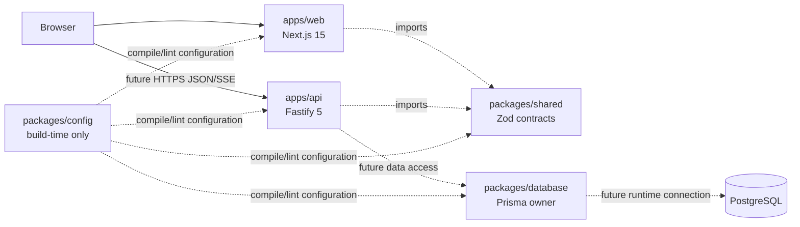
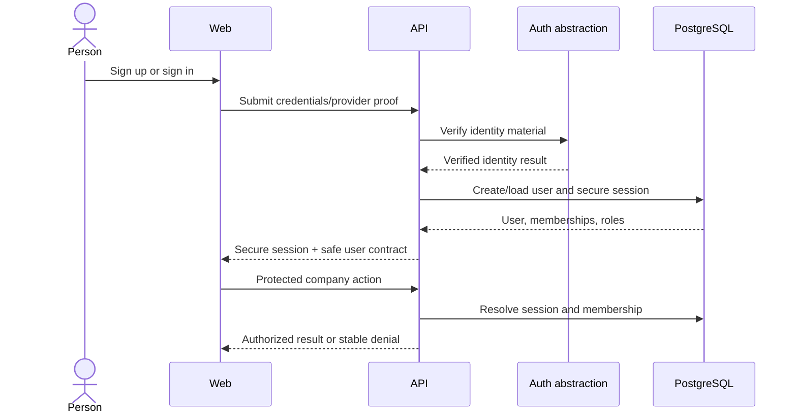
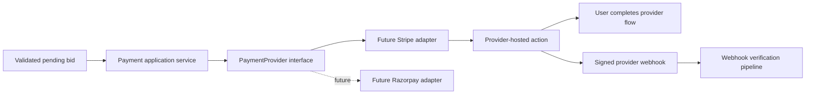
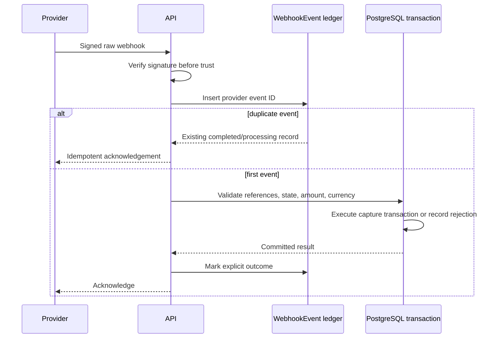
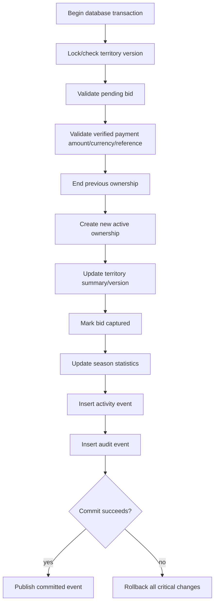
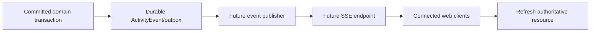
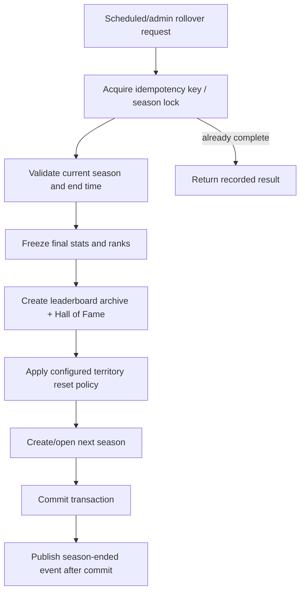

# TakeOver.com Architecture

> **Current status:** Phase 0 is **IN PROGRESS / UNVALIDATED**. Sections labeled **IMPLEMENTED NOW** describe files already committed; **PLANNED** diagrams describe intended product flows, not working systems; **UNVALIDATED / NEEDS REVIEW** marks unresolved choices.

## System Overview

### Phase 0 boundary — UNVALIDATED / NEEDS REVIEW

The approved foundation is a pnpm workspace with two independent deployment units and three shared packages. Only the design/plan and canonical docs exist at this point; runnable applications will be labeled implemented only after verification.



## Frontend and Backend Boundaries

- **PLANNED:** `apps/web` owns product presentation, browser behavior, and frontend orchestration. It does not decide ownership, price legality, verification, payment success, rankings, or scores.
- **PLANNED:** `apps/api` owns HTTP/SSE delivery, application services, authorization, transactional domain workflows, integrations, and backend observability.
- **PLANNED:** `@takeover/shared` is the sole shared contract source. Frontend-only view models remain clearly presentation-specific.
- **PLANNED:** `@takeover/database` is server-only and the sole Prisma owner.

## API Runtime

### Phase 0 — PLANNED

`app.ts` constructs Fastify for injection or hosting; `server.ts` owns environment parsing, listening, signals, shutdown, and exit behavior. Infrastructure plugins remain focused. Phase 0 exposes liveness and application readiness without claiming database readiness.

Future modules live under `apps/api/src/modules/<feature>` only when implemented. Routes remain thin; services/domain logic own decisions; repositories own Prisma queries; integrations implement provider interfaces.

## Database Architecture

- **PLANNED FOR PHASE 0:** PostgreSQL datasource, Prisma client generation, one infrastructure metadata model/migration, and lazy client lifecycle.
- **PLANNED:** Product models include User, Company, CompanyMember, CompanyVerification, TerritoryCategory, Territory, TerritoryOwnership, Bid, Payment, PaymentEvent, WebhookEvent, Season, SeasonCompanyStats, SeasonTerritoryStats, LeaderboardSnapshot, Battle, BattleParticipant, BattleEvent, ActivityEvent, AuditLog, and AdminAction.
- **UNVALIDATED / NEEDS REVIEW:** Exact columns, enum strategy, deletion policy, contention definition, season reset policy, battle scoring, and payment-refund state repair.

Future critical invariants include one active territory owner, unique provider event IDs, unique idempotency keys in scope, safe money checks, immutable financial references, and explicit lifecycle states. PostgreSQL transactions and locks/versions will protect capture workflows.

## Authentication and Authorization — PLANNED

No auth provider is selected or installed.



Authorization uses server-resolved identity, global roles, company memberships, resource state, and action-specific policy. Client-supplied company IDs never prove authority.

## Companies and Verification — PLANNED

Company membership supports users managing multiple companies. DNS TXT is the preferred V1 verification candidate, behind a verification interface. Attempts store server-issued tokens, status, timestamps, and safe failure reasons. Network lookup safety, retry policy, and re-verification cadence require design review.

## Territories and Ownership — PLANNED

Territory summary fields optimize reads but ownership history is authoritative. Exactly one active ownership is enforced at the database boundary. Current owner, amount, version, previous owner, and reign start are updated only inside the capture transaction.

### Bid creation

```mermaid
sequenceDiagram
  actor User
  participant API
  participant Authz as Authorization policy
  participant Pricing as Takeover pricing service
  participant DB as PostgreSQL
  participant Pay as PaymentProvider
  User->>API: POST bid with company, territory, idempotency key
  API->>Authz: Resolve membership and verification
  Authz-->>API: Allowed or denied
  API->>DB: Load authoritative territory/version
  DB-->>API: Owner, amount, increment policy
  API->>Pricing: Compute legal minimum
  Pricing-->>API: Exact integer minor amount
  API->>DB: Create pending bid/payment reference
  API->>Pay: Create provider payment
  Pay-->>API: Provider action or failure
  API-->>User: Review/payment action; never ownership success
```

Stale clients receive current owner/current price and the new legal minimum and must review again. Revised amounts are never auto-charged.

## Payment Architecture — PLANNED

No payment SDK or provider implementation exists. A future `PaymentProvider` interface will expose payment creation, retrieval, webhook verification, refunds, and provider status without leaking provider types into domain services.



Provider checkout completion never directly changes frontend ownership state.

## Webhook Handling — PLANNED



Webhook state records received, processing, processed, ignored, and failed outcomes with retry-safe semantics.

## Atomic Ownership Transfer — PLANNED



External publication happens after commit through a reliable mechanism selected later. A database outbox is a candidate, not an implemented feature.

## Real-time Events — PLANNED

SSE is preferred for V1 but must be validated against deployment limits. Redis is not part of Phase 0.



The frontend may use ambient visuals but cannot fabricate production events or claim SSE/WebSocket connectivity before it exists.

## Cache, Background Jobs, and Redis

- **IMPLEMENTED NOW:** No cache, queue, worker, scheduler, or Redis dependency.
- **PLANNED:** Add ephemeral infrastructure only when measured load, multi-instance fan-out, or retryable job requirements justify it.
- PostgreSQL remains durable truth; caches never decide ownership or payment state.

## Seasons and Leaderboards — PLANNED

One current season is selected by durable state and protected with database constraints/transaction policy. Stats are server-derived. Leaderboard snapshots freeze final ranks.



## Battles — PLANNED / NEEDS REVIEW

A future explicit state machine records challenger, defender, selected territories, start/end, current state, winner, reason, participants, and append-only timeline. No scoring metric will be implemented until it is independently verifiable.

## Audit and Admin — PLANNED

Audit records capture actor, action, target, safe before/after context, request ID, reason, and timestamp. Admin mutations require global authorization and create audit records transactionally. Controlled reversals never edit financial history invisibly.

## Rate Limiting and Security

- **PLANNED:** Endpoint-specific rate limiting, secure session cookies, CSRF strategy, request-size limits, URL/SSRF protections, provider signature validation, replay protection, and abuse signals.
- **PLANNED FOR PHASE 0:** environment validation, safe errors, structured logging, request IDs, and conventional secret redaction.
- ORM use does not replace authorization or database constraints.

## Deployment

- **PLANNED FOR PHASE 0:** independent production builds for `apps/web` and `apps/api`.
- **UNVALIDATED / NEEDS REVIEW:** hosting providers, regions, domain topology, TLS termination, database connection pooling, migration runner, autoscaling, and SSE compatibility.
- Web remains Vercel-compatible. API can deploy independently to a Node-compatible platform.

## Observability

- **PLANNED FOR PHASE 0:** structured application/request logs and health/readiness endpoints.
- **PLANNED:** metrics for latency, errors, database pool, payment/webhook outcomes, transaction conflicts, event lag, and season jobs; tracing across provider callbacks; alerts and runbooks.

## Backup Strategy — PLANNED

Use managed PostgreSQL point-in-time recovery, encrypted backups, documented retention, restricted restore access, and recurring restore exercises. Define recovery point/time objectives before launch. Durable payment/webhook records and audit history are included in restoration validation.

## Environment Variables

### Phase 0 planned variables

| Variable | Scope | Purpose |
| --- | --- | --- |
| `NODE_ENV` | API/server | Runtime mode |
| `API_HOST` | API | Listen host |
| `API_PORT` | API | Listen port |
| `LOG_LEVEL` | API | Pino level |
| `DATABASE_URL` | Prisma/API later | PostgreSQL connection URL |

Provider/auth/email secrets are not defined in Phase 0.

## External Integrations

- **IMPLEMENTED NOW:** None.
- **PLANNED:** PostgreSQL runtime, one identity/email approach, DNS verification lookup, Stripe payment adapter, optional later Razorpay adapter, monitoring/error reporting, and SSE-compatible deployment.

