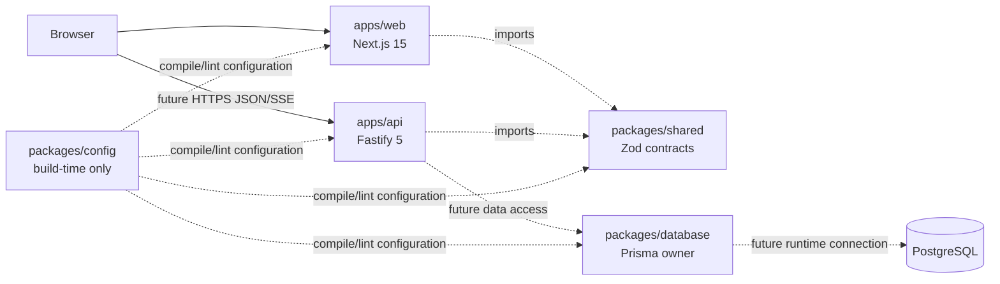
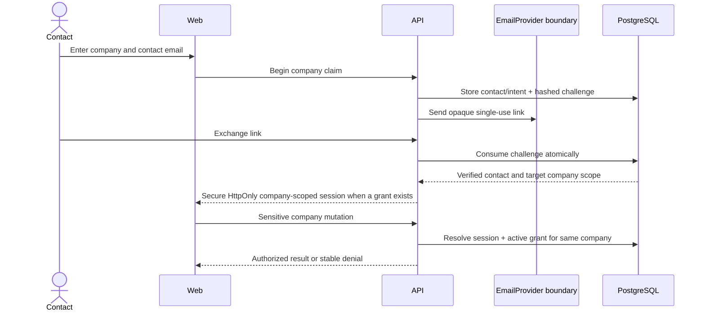
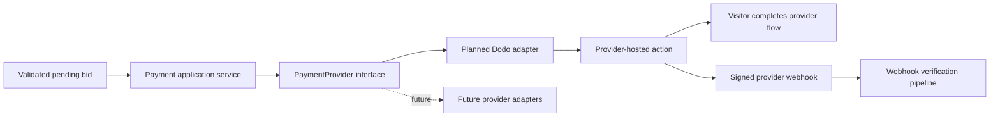
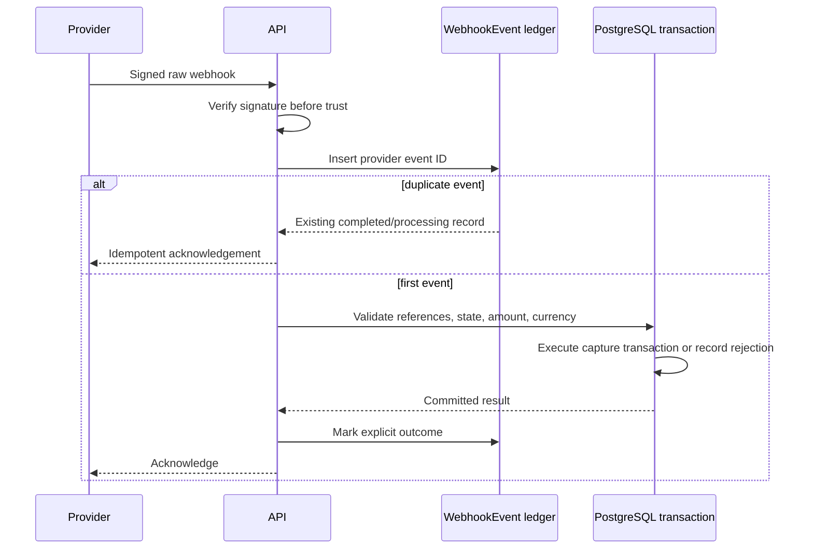
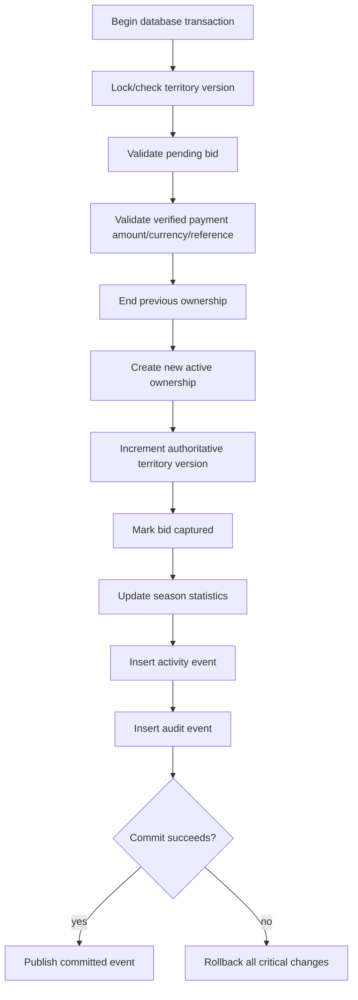
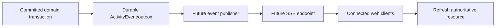
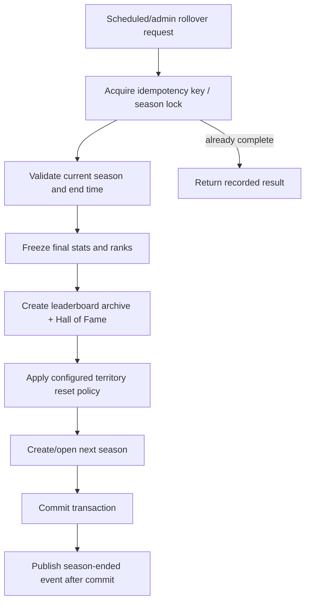

# TakeOver.com Architecture

> **Current status:** Phases 0 and 1 are **IMPLEMENTED NOW / VERIFIED** locally, including both migrations and Phase 1 integration/concurrency tests against a dedicated PostgreSQL 17 test database. Production email delivery and manual-recovery execution are unavailable. **PLANNED** diagrams describe intended later product flows, not working systems.

## System Overview

### Phase 0 boundary — IMPLEMENTED NOW

The pnpm workspace, shared build configuration, canonical docs, independently buildable web/API applications, shared contracts, Prisma package, tests, and runtime smoke check exist and pass the Phase 0 acceptance suite.



## Frontend and Backend Boundaries

- **IMPLEMENTED NOW:** `apps/web` is an independent minimal presentation deployment and does not import database code. Product presentation and orchestration remain planned.
- **IMPLEMENTED NOW:** `apps/api` is an independent Fastify deployment with infrastructure routes plus the Phase 1 company-claim identity module. Territory, payment/capture, competition, and SSE remain planned.
- **IMPLEMENTED NOW:** `@takeover/shared` is the sole shared contract source. Frontend-only view models may remain clearly presentation-specific.
- **IMPLEMENTED NOW:** `@takeover/database` is server-only and the sole Prisma owner.

## API Runtime

### Phase 0 — IMPLEMENTED NOW

`app.ts` constructs Fastify for injection or hosting; `server.ts` owns environment parsing, listening, signals, shutdown, and exit behavior. Infrastructure plugins remain focused. Phase 0 exposes liveness and application readiness without claiming database readiness.

Future modules live under `apps/api/src/modules/<feature>` only when implemented. Routes remain thin; services/domain logic own decisions; repositories own Prisma queries; integrations implement provider interfaces.

### Phase 1 — IMPLEMENTED NOW

`modules/company-identity` contains thin routes, service/domain authorization decisions, and a repository interface with Prisma implementation. Fastify plugins own database, cookie, email-provider, and company-identity wiring. Business rules are HTTP-independent and integration-tested against PostgreSQL.

## Database Architecture

- **IMPLEMENTED NOW:** Prisma `7.10.0` CLI, client, and PostgreSQL adapter are pinned exactly; `prisma.config.ts` owns CLI configuration; the generated client has explicit output; `PrismaPg` supplies the driver adapter; a tested lazy client lifecycle exists.
- **IMPLEMENTED NOW:** The initial SQL migration matches the offline `prisma migrate diff` shape. UUID generation remains Prisma-client-side, so the migration introduces no `pgcrypto` dependency or database default.
- **IMPLEMENTED NOW:** The foundation and company-claim identity migrations apply cleanly to a dedicated PostgreSQL 17 test database; runtime persistence and approve/reject concurrency tests pass.
- **IMPLEMENTED NOW:** Phase 1 models are `Company`, `CompanyContact`, `CompanyVerification`, `EmailVerificationChallenge`, `CompanyManagementGrant`, `CompanyManagementSession`, `CompanyAccessRequest`, `TakeoverIntent`, `AuditLog`, and `SecurityRateLimitBucket`. There is no V1 `User` or `CompanyMember` model.
- **PLANNED:** Phase 2 adds `TerritoryCategory`, `Territory`, and `TerritoryOwnership`; later phases add Bid, Payment, PaymentEvent, WebhookEvent, Season, SeasonCompanyStats, SeasonTerritoryStats, LeaderboardSnapshot, Battle, BattleParticipant, BattleEvent, ActivityEvent, and AdminAction only when implemented.
- **UNVALIDATED / NEEDS REVIEW:** Exact columns, enum strategy, deletion policy, contention definition, season reset policy, battle scoring, and payment-refund state repair.

Future critical invariants include one active territory owner, unique provider event IDs, unique idempotency keys in scope, safe money checks, immutable financial references, and explicit lifecycle states. PostgreSQL transactions and locks/versions will protect capture workflows.

## Company Claim Identity and Authorization — IMPLEMENTED NOW

V1 intentionally has no traditional account system: no `User`, passwords, signup/login, password reset, global end-user roles, or global authenticated dashboard. Company identity is separate from management authority.

The implemented capability flow is an opaque email link exchanged for a short-lived Secure-in-production, HttpOnly, company-scoped management session. Link secrets have at least 256 bits of cryptographically secure randomness; only selectors and keyed digests are stored. Links are purpose-bound, single-use, expiring, and revocable. Sessions and grants authorize exactly one company.



A verified contact has no company authority without an active `CompanyManagementGrant`. A grant is exercised through a valid session scoped to the same company. A session for Company A never authorizes Company B. Company IDs, websites, email strings, payment details, and browser return URLs are not credentials.

## Companies, Contacts, and Verification — IMPLEMENTED NOW

`Company` stores identity and a lifecycle. A new company begins as a private, expiring, non-participating draft and becomes public/active only through the future confirmed capture transaction. `CompanyContact` stores a normalized verified contact channel and is deliberately not a human account. `CompanyManagementGrant` binds a contact to one company, including a draft; `CompanyManagementSession` exercises that grant. The same contact may hold separate grants and sessions for multiple companies without gaining global authority.

`contact_verified` is sufficient for V1 and proves only possession of the contact email. Personal email providers are valid, and the email domain need not match the public website. DNS control, incorporation, and enterprise identity are not required. `domain_verified` and `manually_verified` remain optional future levels.

When a different verified contact selects an existing company with an active manager, the API creates a pending `CompanyAccessRequest`, blocks checkout and mutations, and notifies current managers. Approval atomically creates a target-company grant; rejection cancels or expires the prepared takeover intent. If managers are unreachable, a manual-review request is the only fallback—payment cannot bypass management authorization.

The detailed approved design is `docs/superpowers/specs/2026-08-29-phase-1-company-claim-identity-design.md`. V1 TTLs, the default `SameSite=Lax` cookie policy, exact normalized-website collision behavior, a dev/test email transport, and the external territory-reference seam are locked. Production email delivery, cross-site deployment changes, and manual-reviewer authorization remain **UNVALIDATED / NEEDS REVIEW**.

Implemented Phase 1 routes are `POST /api/company-claims`, email verification issue/exchange, management-link issue/exchange, management context/session revocation, access-request approve/reject, recovery-request creation, and reference-only takeover-intent preparation. Management-link issuance accepts a contact email plus exactly one public locator: an HTTPS company website URL or a slug. The service normalizes the locator, resolves it internally, and returns the same accepted response after valid parsing whether the company/contact/grant is eligible or not. Cookie-authenticated mutations require the company-scoped opaque session, exact trusted Origin, and matching CSRF cookie/header. `GET /__dev/email-captures/:messageId` exists only when development mode, explicit capture enablement, and loopback binding all hold.

Manual recovery execution is **PLANNED / UNAVAILABLE**: the non-public `ManualRecoveryOperatorPort` fails with a typed unavailable result, and no operator credential, approval route, or environment bypass exists. Production email delivery is also **PLANNED**; the implemented in-memory transport is development/test-only.

## Territories and Ownership — PLANNED

The approved Phase 2 design uses `TerritoryOwnership` as the sole source of ownership truth. `Territory` does not duplicate current owner, previous owner, bid, or takeover-price fields. Public current/previous-owner projections are derived from committed reign rows. Stored territory availability is only active or disabled; public `unclaimed`, `claimed`, and `disabled` states are derived from availability plus the active reign. `contested` is absent until Phase 3 has authoritative bidding state.

PostgreSQL will enforce one active reign with a partial unique index and non-overlapping `[capturedAt, endedAt)` ranges with a `btree_gist` exclusion constraint. The Phase 2 migration must run `CREATE EXTENSION IF NOT EXISTS btree_gist`; a production provider that cannot support it is a deployment blocker. Territory bigint versions support locked compare-and-swap transitions and are serialized as decimal strings in JSON.

`displayWeight` is a backend-authoritative `1..100` presentation value. It is independent of price, ownership, bid volume, company size, and gameplay adjacency. CSS mosaic position and physical adjacency remain presentation only.

Phase 2 plans public read APIs for categories, territories, history, public companies, and company holdings. Suspended owners remain truthfully named with public lifecycle status. Five history rows appear in territory detail through one server-owned preview constant; complete history is cursor-paginated. Initial data comes from a small deterministic reviewed seed of unclaimed territories. No ownership mutation HTTP route or general admin surface is introduced.

The existing `TakeoverIntent.territoryExternalRef` remains intact and reference-only. Phase 2 adds a nullable authoritative `territoryId` without rewriting ambiguous references; `quoteAuthority` remains `reference_only` and checkout remains unavailable.

### Bid creation

```mermaid
sequenceDiagram
  actor Contact
  participant API
  participant Authz as Authorization policy
  participant Pricing as Takeover pricing service
  participant DB as PostgreSQL
  participant Pay as PaymentProvider
  Contact->>API: Submit intent with company, territory, idempotency key
  API->>Authz: Resolve verified contact + same-company grant/session
  Authz-->>API: Allowed or denied
  API->>DB: Load authoritative territory/version
  DB-->>API: Owner, amount, increment policy
  API->>Pricing: Compute legal minimum
  Pricing-->>API: Exact integer minor amount
  API->>DB: Compare intent snapshot with current owner/version/amount/currency
  alt quote stale
    API-->>Contact: review_required + current values
  else quote accepted and access approved
  API->>DB: Create pending bid/payment reference
  API->>Pay: Create provider payment
  Pay-->>API: Provider action or failure
    API-->>Contact: Review/payment action; never ownership success
  end
```

`TakeoverIntent` quote snapshots are explanatory and never lock price. Stale clients receive the new owner, current price, new legal minimum, currency, and version and must explicitly review again. Revised amounts are never auto-charged. Existing-company access approval does not approve a changed quote.

## Payment Architecture — PLANNED

No payment SDK or provider implementation exists. Phase 3 will introduce a provider-neutral `PaymentProvider` interface for checkout creation, payment retrieval, raw-webhook verification, refunds, and provider status. Dodo Payments is the planned first V1 adapter. Dodo SDK/API types must remain inside `DodoPaymentProvider` and cannot leak into bidding, ownership, or shared domain contracts.



Provider checkout completion and browser success/return URLs never directly change frontend ownership state. A confirmed payment that cannot legally produce a capture enters an explicit reconciliation/refund state; it never silently changes the bid, charge, or ownership. Dodo signatures, webhook events, retries, SDK behavior, and refund semantics are **UNVALIDATED / NEEDS REVIEW** until Phase 3 checks current official Dodo documentation.

## Webhook Handling — PLANNED



Webhook state records received, processing, processed, ignored, and failed outcomes with retry-safe semantics.

## Atomic Ownership Transfer — PLANNED



External publication happens after commit through a reliable mechanism selected later. A database outbox is a candidate, not an implemented feature.

For a first capture by a new company, the future transaction revalidates and activates its private draft while establishing ownership. The verified contact relationship and draft-scoped management grant already exist independently and are revalidated. For an existing managed company, authority must already exist before checkout. A payment can never create an unauthorized grant for an existing company.

## Real-time Events — PLANNED

SSE is preferred for V1 but must be validated against deployment limits. Redis is not part of Phase 0.



The frontend may use ambient visuals but cannot fabricate production events or claim SSE/WebSocket connectivity before it exists.

## Cache, Background Jobs, and Redis

- **IMPLEMENTED NOW:** No cache, queue, worker, scheduler, or Redis dependency.
- **PLANNED:** Add ephemeral infrastructure only when measured load, multi-instance fan-out, or retryable job requirements justify it.
- PostgreSQL remains durable truth; caches never decide ownership or payment state.

## Seasons and Leaderboards — PLANNED

One current season is selected by durable state and protected with database constraints/transaction policy. Stats are server-derived. Leaderboard snapshots freeze final ranks.



## Battles — PLANNED / NEEDS REVIEW

A future explicit state machine records challenger, defender, selected territories, start/end, current state, winner, reason, participants, and append-only timeline. No scoring metric will be implemented until it is independently verifiable.

## Audit — IMPLEMENTED NOW; Admin — PLANNED

Audit records capture actor type, company-scoped grant/session where applicable, action, target, safe before/after context, request ID, reason, and timestamp. Phase 1 security actions—including challenge exchange, grant/session revocation, access-request decisions, and recovery requests—are audited. A later operator identity and authorization model must be designed separately; V1 company sessions do not confer administrator authority. Controlled reversals never edit financial history invisibly.

## Rate Limiting and Security

- **IMPLEMENTED NOW:** Phase 1 endpoint-specific rate limits; selector-plus-secret tokens with at least 256 bits of secret entropy and keyed digests at rest; purpose/scope/expiry/consumption/revocation checks; company-scoped Secure-in-production/HttpOnly cookies; exact-Origin and CSRF checks; practical enumeration resistance; public-HTTPS URL restrictions; environment validation; safe errors; structured logging; request IDs; and secret redaction.
- **IMPLEMENTED NOW:** Critical link issuance, access/recovery request, exchange, and notification throttles use durable PostgreSQL buckets/counters so correctness does not depend on one process. Redis is not required or installed.
- **PLANNED:** Provider signature validation, payment replay protection, broader abuse signals, and deployment-level request/body limits belong to later reviewed phases.
- ORM use does not replace authorization or database constraints.

## Deployment

- **IMPLEMENTED NOW:** independent production builds for `apps/web` and `apps/api`; the web application deploys with the standard Next.js `next build` / `next start` output.
- **UNVALIDATED / NEEDS REVIEW:** Next's optional `output: 'standalone'` packaging was not retained because pnpm symlink creation was denied by this Windows environment. It is not required for Vercel or standard `next start` deployment and can be re-evaluated in the actual deployment environment.
- **UNVALIDATED / NEEDS REVIEW:** hosting providers, regions, domain topology, TLS termination, database connection pooling, migration runner, autoscaling, and SSE compatibility.
- Web remains Vercel-compatible. API can deploy independently to a Node-compatible platform.

## Observability

- **IMPLEMENTED NOW:** structured application/request logs with credential redaction, request IDs, `/health`, and application-only `/ready`.
- **PLANNED:** metrics for latency, errors, database pool, payment/webhook outcomes, transaction conflicts, event lag, and season jobs; tracing across provider callbacks; alerts and runbooks.

## Backup Strategy — PLANNED

Use managed PostgreSQL point-in-time recovery, encrypted backups, documented retention, restricted restore access, and recurring restore exercises. Define recovery point/time objectives before launch. Durable payment/webhook records and audit history are included in restoration validation.

## Environment Variables

### Phase 0 implemented variables

| Variable       | Scope            | Purpose                   |
| -------------- | ---------------- | ------------------------- |
| `NODE_ENV`     | API/server       | Runtime mode              |
| `API_HOST`     | API              | Listen host               |
| `API_PORT`     | API              | Listen port               |
| `LOG_LEVEL`    | API              | Pino level                |
| `DATABASE_URL` | Prisma/API later | PostgreSQL connection URL |

Provider, email, token-pepper, and session secrets are not defined in Phase 0. Phase 1 variables will be selected in its implementation plan and documented before use; Dodo variables belong to Phase 3.

### Phase 1 implemented identity defaults

| Setting                           |    Default |
| --------------------------------- | ---------: |
| Email verification TTL            | 15 minutes |
| Management/access-review link TTL | 15 minutes |
| Management session TTL            |    8 hours |
| Access request TTL                |     7 days |
| Company draft TTL                 |   24 hours |
| Recovery request TTL              |     7 days |

The Phase 1 API validates these as runtime configuration. Management cookies are opaque and server-resolved, `HttpOnly`, `Secure` in production, `SameSite=Lax` by default, have no `Domain`, and use `Path=/api`.

## External Integrations

- **IMPLEMENTED NOW:** PostgreSQL runtime through Prisma/`@prisma/adapter-pg`, verified against a dedicated PostgreSQL 17 test database; an `EmailProvider` boundary with development/test-only transport; and an explicit unavailable production transport.
- **PLANNED:** A production email adapter for passwordless contact verification and management links; Dodo Payments as the Phase 3 V1 payment adapter; optional future domain/manual verification; monitoring/error reporting; and SSE-compatible deployment.
- **UNVALIDATED / NEEDS REVIEW:** Production email-provider behavior and Dodo's current API, webhook signatures, retries, SDK, event mapping, and refund semantics.
