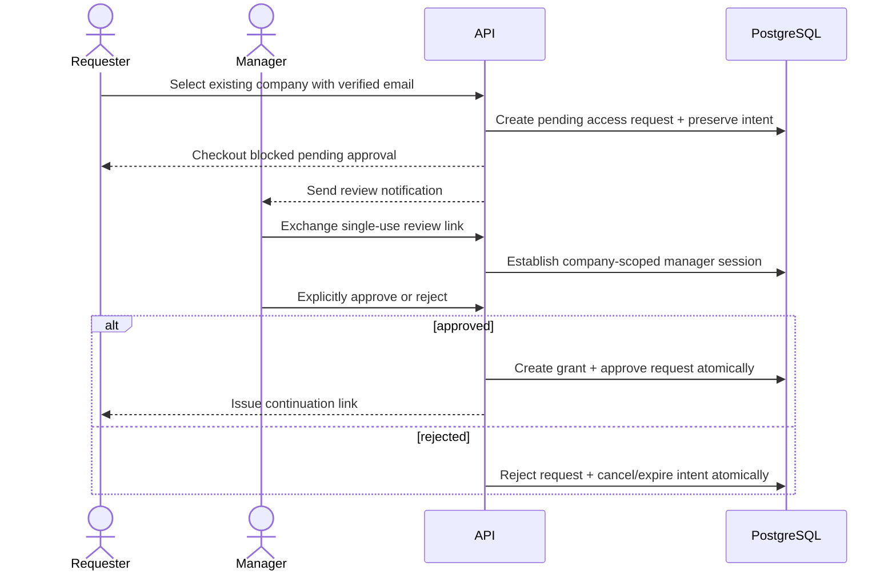

# TakeOver.com Phase 1 Company + Claim Identity Design

**Status:** APPROVED on 2026-08-29; documentation only. Phase 1 implementation has not started.

## Purpose

Phase 1 establishes a low-friction, passwordless way for startup founders and company representatives to prepare a takeover and later manage one company without creating a traditional TakeOver account.

The identity model supports the core loop without becoming a generic account product:

> See territory -> beat current price -> capture territory -> defend it -> build an empire.

Company identity, contact verification, management authority, payment, and territory ownership are separate facts. A verified email proves control of a management channel. It does not prove control of a website domain, and a payment does not grant management authority.

## Status and Phase Boundary

### IMPLEMENTED NOW

- The verified Phase 0 pnpm monorepo, Fastify API foundation, Prisma owner package, framework-neutral shared package, structured logging, health routes, and tests.
- No product identity, email, company, takeover, payment, or ownership code.

### PLANNED FOR PHASE 1

- Company/contact persistence and validation.
- Email verification challenges.
- Company-scoped management grants and short-lived sessions.
- Existing-company access requests with approve/reject behavior.
- Manual-recovery request architecture.
- Rate limits and audit records for identity-sensitive actions.
- A `TakeoverIntent` domain/contract seam that preserves preparation without locking a price.

### EXCLUDED FROM PHASE 1

- A `User` model, signup, login, passwords, password reset, or a global authenticated dashboard.
- Territory schema or authoritative ownership; those belong to Phase 2.
- Pricing, checkout, payments, Dodo integration, webhooks, and atomic capture; those belong to Phase 3.
- DNS/domain verification or manual-verification execution.
- A general administrator identity system.

## Product Decisions

1. A startup may use any verified contact email, including a personal Gmail address, with any valid public company website.
2. V1 does not require a matching-domain email, DNS access, incorporation, a company email, or enterprise identity.
3. `contact_verified` is sufficient for V1 participation. `domain_verified` and `manually_verified` are future levels.
4. Company identity is public product data. Management authority is a private, revocable company-scoped capability.
5. A management session for Company A cannot authorize Company B, even when the same contact manages both.
6. An existing managed company cannot be claimed by verifying a second email or making a payment.
7. A prepared takeover intent explains the quote the visitor saw; it never locks that quote.
8. Browser return/success URLs never establish ownership. Only verified server-side payment state may participate in capture.

## Recommended Capability Architecture

The approved mechanism is:

> Opaque email link -> exchange -> short-lived company-scoped HttpOnly management session.

Email links contain a public selector plus at least 256 bits of cryptographically secure secret material. PostgreSQL stores the selector and a keyed digest of the secret, never the raw token. Opening the link exchanges a valid single-use token for a company-scoped session; authorization subsequently uses the session, not the URL.

Approval links do not approve on `GET`. They establish or refresh the approving manager's scoped session and lead to a confirmation screen. Approval or rejection requires an explicit mutation request with CSRF defenses.

This stateful design is preferred over a stateless signed bearer token because consumption, expiry, grant revocation, session revocation, and auditability are first-class requirements.

## Domain Model Outline

Exact Prisma columns and indexes will be finalized in the Phase 1 implementation plan and migration review. All durable models use opaque IDs and UTC timestamps.

### `Company`

Company identity: normalized name, slug, canonical public website URL, optional validated logo URL, lifecycle status, and timestamps. It has no password, login identity, or implicit manager field.

A brand-new company begins as a private, expiring `draft`. It is not publicly listed, does not participate, owns nothing, and does not reserve a permanent public identity merely by existing. Email verification may create a management grant/session scoped only to that draft. A future successful capture transaction activates the draft and establishes ownership atomically. Existing companies are referenced by ID. Collision and activation checks run again during capture so an abandoned or racing draft cannot squat an active company identity.

### `CompanyContact`

A normalized email delivery/contact record with verification status and timestamps. It is deliberately not a `User`: it has no password, profile, global role, or global session. One verified contact may receive separate grants for multiple companies.

### `CompanyVerification`

An append-oriented record of a company verification level, status, evidence reference, verifier/source, attempts, verified/failed/revoked times, and safe failure reason.

Supported vocabulary:

- `contact_verified` — Phase 1/V1 participation level.
- `domain_verified` — future optional level.
- `manually_verified` — future optional level.

Contact verification proves the email challenge for the contact backing the company relationship; it does not assert website control.

Effective `contact_verified` participation requires at least one active management grant backed by a currently verified contact. Revoking the last qualifying grant/contact removes future checkout eligibility but does not rewrite historical ownership or payment records.

### `EmailVerificationChallenge`

A purpose-bound, single-use challenge containing an indexed public selector, keyed token digest, contact/email reference, optional company/access-request scope, expiry, consumed/revoked timestamps, attempt metadata, and issuance context.

Purposes are explicit, such as contact verification, management-link exchange, access-request review, or recovery continuation. A token issued for one purpose cannot be reused for another.

### `CompanyManagementGrant`

The durable authorization relationship between a verified `CompanyContact` and one `Company`. It records status, grant source, access-request reference where applicable, granted/revoked timestamps, granting manager grant where applicable, and audit context.

An active grant is necessary but not sufficient for a mutation: the request also needs a valid session scoped to the same company.

### `CompanyManagementSession`

A short-lived, revocable session bound to exactly one management grant and company. It stores only a keyed token digest plus lifecycle and security metadata. It never carries global company authority. A contact managing two companies receives two separately scoped sessions.

### `CompanyAccessRequest`

A request by a verified contact to manage an existing company that already has an active verified manager.

States:

- `pending`
- `approved`
- `rejected`
- `expired`
- `cancelled`

It records requested contact, company, associated prepared takeover intent when available, request/expiry/decision timestamps, approving management grant where applicable, rejection/cancellation reason codes, notification state, and audit metadata. Terminal decisions are idempotent and cannot be silently reversed.

### `TakeoverIntent`

A preparation record or domain contract containing a new-company draft or existing company reference, verified contact, intended territory reference, intended bid, quote snapshot, currency, territory version, access state, quote-review state, expiry, and timestamps.

The quote snapshot is explanatory only. Phase 1 defines the seam and state machine. Phase 2 adds the authoritative territory relationship; Phase 3 adds pricing, checkout, and payment relationships. Phase 1 must not create a placeholder territory model or claim checkout support.

Suggested states include `draft`, `awaiting_email_verification`, `awaiting_company_access`, `review_required`, `ready_for_checkout`, `expired`, `cancelled`, and later Phase 3 terminal/payment states. `ready_for_checkout` cannot be reached in a deployed flow until Phase 2/3 prerequisites exist.

### `AuditLog`

Append-oriented security/domain evidence with actor type, management grant/session when applicable, action, target type/ID, request ID, safe metadata, reason, network/client context according to retention policy, and timestamp. Secrets, raw tokens, full cookies, and provider signatures are never stored.

## Core Flows

### New company preparation

```mermaid
sequenceDiagram
  actor Visitor
  participant Web
  participant API
  participant Email as Future email adapter
  participant DB as PostgreSQL
  Visitor->>Web: Select territory and enter company/contact details
  Web->>API: Create prepared takeover intent
  API->>API: Validate and normalize public fields
  API->>DB: Store intent + contact + hashed challenge
  API->>Email: Send opaque verification link
  Visitor->>API: Exchange single-use email link
  API->>DB: Consume challenge, verify contact, grant draft-company scope
  API-->>Web: Secure session for the draft company
  Note over API,DB: Draft is private/non-participating; ownership is not established
```

When Phase 3 exists, checkout is created only after all current eligibility and price checks pass. A verified webhook may then atomically activate the draft company and establish the payment result and ownership. The already verified contact/grant remains separate authority and is revalidated inside that transaction. The browser return URL cannot perform this operation.

### Existing managed company access



A requester cannot edit the company, initiate payment, or alter ownership while the request is pending. If no active manager is reachable, the requester can open a manual recovery request; no payment-based bypass exists.

### Stale quote review

Before Phase 3 creates checkout, the service reloads the authoritative territory version, owner, winning amount, legal minimum, and currency. A mismatch moves the intent to `review_required` and returns both the prior snapshot and current values. The requester must explicitly accept a newly calculated quote. Approval of company access never accepts a changed price, and no revised amount is automatically charged.

## Proposed HTTP Contracts

Paths are proposed for implementation-plan review; shared Zod request/response schemas will live in `@takeover/shared`. All responses use the existing success/error envelopes.

| Endpoint                                        | Purpose                                                                       | Authority                                     |
| ----------------------------------------------- | ----------------------------------------------------------------------------- | --------------------------------------------- |
| `POST /api/company-claims`                      | Validate company/contact input and begin a new or existing-company claim flow | Public, rate-limited                          |
| `POST /api/email-verifications`                 | Issue or reissue a purpose-bound email challenge                              | Public, enumeration-resistant, rate-limited   |
| `POST /api/email-verifications/exchange`        | Consume a verification link without logging its secret                        | Opaque single-use token                       |
| `POST /api/company-management-links`            | Request a management link for a known company/contact pair                    | Public, enumeration-resistant, rate-limited   |
| `POST /api/company-management-links/exchange`   | Exchange a management link for a scoped HttpOnly session                      | Opaque single-use token                       |
| `GET /api/company-management/context`           | Return the current session's company-scoped safe context                      | Company-scoped session                        |
| `DELETE /api/company-management/session`        | Revoke the current management session                                         | Company-scoped session                        |
| `POST /api/company-access-requests`             | Create/deduplicate a pending request for an existing company                  | Verified contact, rate-limited                |
| `POST /api/company-access-requests/:id/approve` | Approve and grant access explicitly                                           | Active manager session for the same company   |
| `POST /api/company-access-requests/:id/reject`  | Reject and cancel/expire the prepared intent                                  | Active manager session for the same company   |
| `POST /api/company-access-requests/:id/cancel`  | Cancel one's own pending request                                              | Request continuation capability               |
| `POST /api/company-recovery-requests`           | Open the manual-review fallback                                               | Verified contact, rate-limited                |
| `POST /api/takeover-intents`                    | Create/update preparation through the Phase 1 seam                            | Verified contact or same-company session      |
| `POST /api/takeover-intents/:id/review-quote`   | Explicitly accept a later authoritative quote                                 | Same intent capability; functional in Phase 3 |

Mutation endpoints using cookies require CSRF protection and Origin validation. Token landing URLs must avoid state-changing `GET` behavior and scrub secrets from browser history as part of exchange.

## Authorization Invariants

1. No company ID, slug, website, email string, payment identifier, or browser return URL proves authority.
2. A verified contact has no company authority without an active grant for that company.
3. A grant has no request authority without a valid session scoped to that same grant and company.
4. Company A sessions always fail Company B authorization.
5. A pending/rejected/expired/cancelled access request grants no authority and cannot start checkout.
6. Only an existing active manager for the target company may approve or reject a normal access request.
7. Payment never creates access to an existing managed company.
8. New-company draft authority may be established after email verification, but it authorizes only that private draft. Participation, company activation, and ownership require the later backend-confirmed capture transaction.
9. Access-request and token state transitions are atomic, explicit, idempotent where retryable, and audited.
10. Revoking a management grant revokes or invalidates all sessions derived from it.
11. Losing the last active verified-contact grant removes effective `contact_verified` eligibility for future checkout without rewriting historical captures.

## Token, Cookie, and Abuse Controls

- Generate token secrets with a cryptographically secure random source and at least 256 bits of entropy.
- Use selector-plus-secret tokens; store an indexed selector and keyed digest of the secret with a separately managed server pepper.
- Compare digests in constant time where applicable.
- Never persist or log raw tokens, cookie contents, authorization headers, provider signatures, or credential-bearing URLs.
- Bind tokens to one purpose, subject, company/access request when applicable, expiry, and single consumption.
- Rotate a session identifier when exchanging a link or changing authority.
- Use `Secure`, `HttpOnly`, narrowly scoped cookies and the deployment-appropriate `SameSite` policy. Default to same-site deployment with `Lax`; any cross-site deployment requires `SameSite=None`, explicit CSRF tokens, strict Origin checks, and a documented CORS policy.
- Expire management sessions after a short configurable lifetime and support explicit revocation and grant-wide invalidation.
- Return generic issuance responses so attackers cannot reliably enumerate emails or managers.
- Apply database-backed issuance and decision throttles so multi-instance correctness does not depend on in-memory limits. Edge/process limits may supplement them. Redis is not required by this design.
- Deduplicate equivalent pending access requests and throttle manager notifications independently from request creation.
- Email security links should use `Referrer-Policy: no-referrer`, avoid third-party resources on the exchange page, and redirect to a clean URL after exchange.

## Validation Rules

- Company name is normalized for comparison while preserving a display form.
- Website must be an absolute public `https` URL in production; normalization, allowed schemes, credentials, ports, and canonical origin rules are server-owned.
- Logo is optional. Any server-side fetch requires SSRF, redirect, DNS-rebinding, size, MIME, and timeout controls; Phase 1 may accept a validated external reference without fetching it.
- Email is normalized conservatively and verified only through possession of the delivered challenge. Do not alter provider-specific local-part semantics beyond agreed normalization.
- A matching company website and contact email domain is never required.
- Company matching detects likely existing records, but identity collisions do not automatically grant or merge authority.

## Payment Boundary — PLANNED PHASE 3

Dodo Payments is the V1 provider, behind an internal provider-neutral interface:

```ts
interface PaymentProvider {
  createCheckout(input: CreateCheckoutInput): Promise<CheckoutResult>;
  getPayment(reference: ProviderPaymentReference): Promise<PaymentResult>;
  verifyWebhook(input: RawWebhookInput): Promise<VerifiedPaymentEvent>;
  refund(input: RefundInput): Promise<RefundResult>;
  getStatus(reference: ProviderPaymentReference): Promise<PaymentStatus>;
}
```

`DodoPaymentProvider` will own all Dodo SDK/API types and status translation. Domain services use only internal types. Provider-neutral payment records will carry provider, provider payment/checkout IDs, integer minor amount, currency, internal status, company, territory, bid/takeover intent, and timestamps.

Dodo webhook verification, signatures, event IDs, retries, event schema, payment states, refund semantics, and SDK choice are **UNVALIDATED / NEEDS REVIEW** until Phase 3 checks current official Dodo documentation. No Stripe-first adapter is planned.

Later webhook processing must verify signatures, prevent replay, deduplicate events, validate amount/currency/internal references, and map to internal state before capture. If a confirmed payment cannot legally capture, it enters an explicit reconciliation/refund state; the system never silently changes the bid, charge, or ownership.

## Service and Repository Boundaries

Phase 1 will add only modules with real behavior. Likely feature boundaries are companies, company claims/access, and management capabilities rather than a generic `auth` module.

- Fastify routes parse shared schemas, apply transport controls, and call one application operation.
- Services own challenge issuance/exchange, access-request transitions, authorization policy, and audit decisions independently of HTTP.
- Repositories own Prisma persistence and accept a transaction client for atomic state changes.
- Email delivery is behind a small provider interface. No provider is selected by this specification.
- Token generation, hashing, and cookie serialization are infrastructure services and never leak secrets into shared contracts.

No Nest-style container, generic controller hierarchy, Redis, queue, worker, Dodo SDK, or placeholder product modules are introduced by the specification.

## Testing Strategy

### Unit tests

- Token entropy/format and keyed digest verification.
- Purpose, expiry, consumption, and revocation decisions.
- Company-scoped authorization including cross-company denial.
- Access-request state transition table and terminal-state idempotency.
- Quote-snapshot comparison and `review_required` transition.
- URL/email normalization and validation.
- Enumeration-safe response mapping.

### PostgreSQL integration tests

- Challenge single consumption under concurrency.
- Grant/session revocation and cross-company isolation.
- Duplicate access-request prevention and notification throttling.
- Concurrent approve/reject requests produce one terminal state.
- Approval atomically creates the grant and audit record.
- Rejection atomically cancels/expires the associated intent and audits the decision.
- Rate limits work across application instances through durable state.

### Fastify integration tests

- Cookie flags, CSRF/Origin checks, generic issuance responses, validation errors, and stable envelopes.
- Unauthorized, expired, revoked, wrong-purpose, wrong-company, and replayed token/session paths.
- No state mutation occurs from link landing `GET` or an unverified email.

Email delivery and future Dodo behavior require provider sandbox/contract tests when their providers are selected or implemented. They cannot be claimed from mocks alone.

## Acceptance Criteria

Phase 1 may be marked complete only when:

1. No traditional V1 account/password path exists.
2. A contact can verify an email using a single-use expiring challenge.
3. Raw token material is neither persisted nor logged.
4. A valid link exchanges into a short-lived company-scoped secure session.
5. Cross-company authorization is denied and tested.
6. Existing-company requests remain blocked until an active manager explicitly approves them.
7. Approval grants only the target company and rejection grants nothing.
8. Manual recovery can be requested without creating an automatic authority-transfer path.
9. Access-request notifications and token endpoints are rate-limited and enumeration-resistant.
10. Every sensitive state change creates an audit record transactionally where required.
11. The takeover-intent seam treats snapshots as non-binding and supports `review_required` without starting payment.
12. PostgreSQL integration tests prove concurrency-sensitive security invariants.
13. Shared contracts remain framework-neutral, Prisma remains solely in `packages/database`, and web/API remain independently deployable.
14. Dodo checkout, payment, webhook, and capture remain clearly unimplemented Phase 3 work.

## Risks and Mitigations

- **Email compromise:** short expiry, single use, scoped sessions, revocation, security notifications, and recovery policy.
- **Company squatting:** keep unpaid companies private/expiring and non-participating; recheck identity collisions at activation; never merge or grant existing-company access automatically.
- **Access-request spam:** durable rate limits, deduplication, notification throttles, generic responses, and abuse audit signals.
- **Email link scanners:** link `GET` does not approve/reject; exchange and explicit mutation are separate.
- **Bearer-token leakage:** no raw storage/logging, clean redirect after exchange, no-referrer exchange page, short expiry, and session rotation.
- **Cross-company privilege escalation:** company ID is part of every grant/session authorization check and negative tests are mandatory.
- **Stale pricing:** snapshots never lock price; checkout revalidation and explicit review are mandatory in Phase 3.
- **Provider ambiguity:** Dodo facts remain unvalidated until official documentation and sandbox behavior are tested.

## Unresolved Questions

These do not change the approved architecture but must be decided before or during the Phase 1 implementation plan:

1. Email delivery provider, sender-domain setup, retry/bounce handling, and local test transport.
2. Exact TTLs for verification links, approval links, management links, sessions, access requests, and takeover intents.
3. Canonical company website uniqueness, collision/merge policy, and handling of admin-seeded companies with no active manager.
4. Production web/API domain topology, which determines the final cookie `SameSite`, CORS, and CSRF configuration.
5. Manual reviewer identity, operational authorization, evidence requirements, SLA, and recovery notification policy. Phase 1 may create recovery requests but cannot invent an unsafe global admin login.
6. Whether Phase 1 persists a partial `TakeoverIntent` before Phase 2 or publishes only its contract/state seam until an authoritative territory foreign key exists. No unenforced or placeholder territory model is permitted.
7. Dodo's current webhook/signature/retry/refund details, deferred to official-documentation review in Phase 3.

## Phase 0 Compatibility Self-Review

- The design preserves the pnpm workspace and independently deployable `apps/web` and `apps/api` boundaries.
- Shared request/response contracts remain in framework-neutral `@takeover/shared`; no Fastify, Prisma, Node secret, or provider type enters that package.
- `packages/database` remains the only Prisma schema/client owner.
- Fastify's plugin-based, thin-route architecture remains unchanged; business rules remain testable outside HTTP.
- PostgreSQL remains the source of truth for grants, sessions, challenges, access transitions, and audit evidence.
- Money remains integer minor units and price decisions remain server-authoritative.
- No Redis, queue, worker, auth provider, email provider, Dodo SDK, or speculative Phase 2/3 product module is added by this documentation change.
- Phase 0 implementation and verification claims remain unchanged.

## Documentation and Handoff Consequences

The canonical PRD, architecture, rules, phases, design rules, and shared memory must describe this capability model and remove the superseded V1 account/password plan. Claude may design company-entry, verification-sent, pending approval, approval/rejection, stale-quote, and management-link exchange states, but must not implement a login page or imply email delivery, session establishment, payment, or capture exists before the corresponding backend is implemented.
